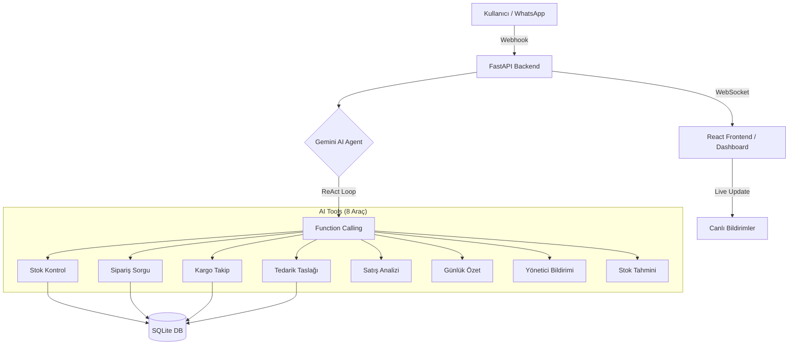

# 🦾 KooPilot — KOBİ'ler İçin AI Destekli Operasyon Asistanı

KooPilot, KOBİ'lerin günlük operasyonlarını (stok, sipariş, kargo) otonom bir şekilde yöneten, Gemini tabanlı bir **Yapay Zeka Ajanı** (AI Agent) sistemidir. Klasik kural tabanlı botların aksine, kullanıcı taleplerini doğal dil üzerinden anlayarak uygun araçları (tools) kendi seçer ve karmaşık iş süreçlerini insan müdahalesi olmadan tamamlar.

## ✨ Öne Çıkan Özellikler
- 📱 **Otonom WhatsApp Entegrasyonu:** Müşteri taleplerini anında yanıtlar ve işlem yapar.
- 📊 **Akıllı Stok Yönetimi:** Stokları anlık takip eder ve kritik seviyede yöneticiyi uyarır.
- 📧 **Otomatik Tedarik Zinciri:** Azalan ürünler için tedarikçiye hazır sipariş taslakları oluşturur.
- 📈 **Stok Tahminleme:** Geçmiş verilere bakarak ürünlerin ne zaman tükeneceğini öngörür.
- 🚚 **Kargo Entegrasyonu:** Gerçek zamanlı kargo durumunu sorgular ve müşteriye iletir.
- 🔔 **Canlı Dashboard:** WebSocket üzerinden yöneticiye anlık operasyonel bildirimler gönderir.

## 🏗️ Sistem Mimarisi

KooPilot, modern bir "Agentic" mimari üzerine inşa edilmiştir.

## 🧠 Neden "Gerçek" AI Agent?
KooPilot'u piyasadaki basit chatbotlardan ayıran en büyük özellik, **kural tabanlı olmamasıdır.**

- **Otonom Karar Mekanizması:** Sistemde binlerce `if/else` bloğu yoktur. Gemini modeli, kullanıcının niyetini anlar ve elindeki 8 araçtan hangisini, hangi sırayla ve hangi parametrelerle çağıracağına **tamamen kendi karar verir.**
- **ReAct (Reason → Act → Observe) Döngüsü:** 
  1. **Reason (Muhakeme):** Kullanıcı "128 nerede?" dediğinde, model önce bunun bir sipariş sorusu olduğunu anlar.
  2. **Act (Eylem):** `get_order_status` aracını çağırır.
  3. **Observe (Gözlem):** Gelen veride kargo numarası olduğunu görürse, bu kez `get_cargo_status` aracını çağırarak derinleşir.
  4. **Final Response:** Tüm bu zincirleme işlemlerin sonucunda kullanıcıya "Siparişiniz kargoda, yarın 14:00'te kapınızda" der.

## 🛠️ Yetenekler (AI Tools)

| Tool Adı | Fonksiyonu | Tetiklenme Durumu |
| :--- | :--- | :--- |
| `check_stock` | Ürün stok ve fiyat bilgisini çeker. | "Domates var mı?" gibi sorularda. |
| `get_order_status` | Sipariş durumunu sorgular. | "Siparişim ne durumda?" denildiğinde. |
| `get_cargo_status` | Kargo takip verisini getirir. | "Paketim nerede?" sorusunda. |
| `draft_supplier_order`| Tedarikçi sipariş maili hazırlar. | "Stok az, tedarikçiye yaz" denildiğinde. |
| `get_sales_analytics` | Satış raporları üretir. | "En çok ne sattık?" sorgusunda. |
| `get_daily_summary` | Günlük operasyonel özet sunar. | "Bugün durumlar nasıl?" denildiğinde. |
| `get_stock_forecast` | Stok tükenme tahmini yapar. | "Hangisi bitmek üzere?" sorusunda. |
| `manager_notif` | Dashboard'a acil bildirim düşer. | Kritik hatalar veya özel isteklerde. |

## 🎬 Demo Senaryoları

### Senaryo 1: Otonom Müşteri Bilgilendirme
- **Kullanıcı:** "128 numaralı siparişim ne zaman gelir?"
- **KooPilot:** (Arka planda siparişi bulur, kargo takip numarasını çeker, kargo firmasından canlı konumu alır) "Sayın Ahmet, ORD-128 nolu siparişiniz şu an İstanbul Dağıtım Merkezi'nde. Bugün 16:00'ya kadar teslim edilecek."

### Senaryo 2: Tedarik Zinciri Otomasyonu
- **Yönetici:** "Zeytinyağı stoğu çok az, tedarikçiye bir şeyler yap."
- **KooPilot:** (Stok eşiğini kontrol eder, tedarikçi bilgilerini çeker) "Zeytinyağı stoğu kritik seviyede (5 adet). Yıldız Tarım firmasına 20 adetlik sipariş taslağını hazırlayıp bildirimlerinize ekledim."

### Senaryo 3: Proaktif İş Analitiği
- **Yönetici:** "Genel durum nedir?"
- **KooPilot:** (Satışları, bekleyen siparişleri ve tükenmek üzere olan ürünleri analiz eder) "Bugün 15 yeni sipariş var. Domates stoğu 2 gün içinde tükenebilir. Toplam ciro dünden %10 daha yüksek."

## 🚀 Kurulum

1. **Bağımlılıklar:** `pip install -r requirements.txt`
2. **Ortam Değişkenleri:** `.env` dosyasına Gemini ve Twilio API anahtarlarınızı ekleyin.
3. **Başlat:** `python main.py`
4. **WhatsApp:** Twilio Sandbox üzerinden `join <kod>` yazarak asistanı uyandırın.

## 🛠️ Teknolojiler
- **Backend:** FastAPI, Python, SQLAlchemy
- **AI:** Google Gemini 2.0 Flash (Function Calling & ReAct)
- **Frontend:** React, Vite, WebSocket
- **Veri:** SQLite (Local storage)
- **İletişim:** Twilio WhatsApp API & Ngrok
